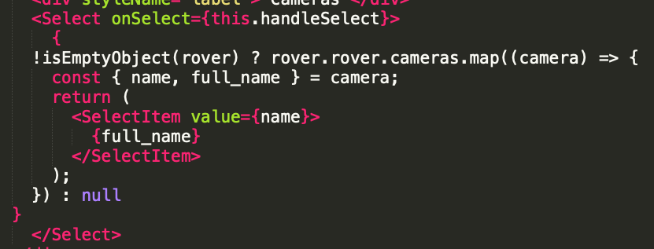
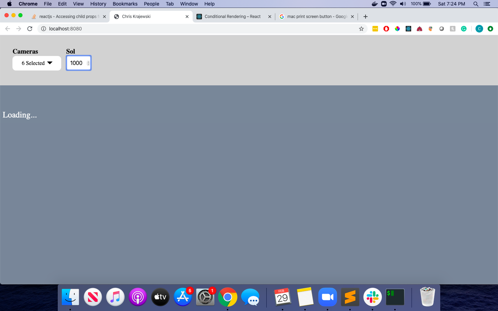
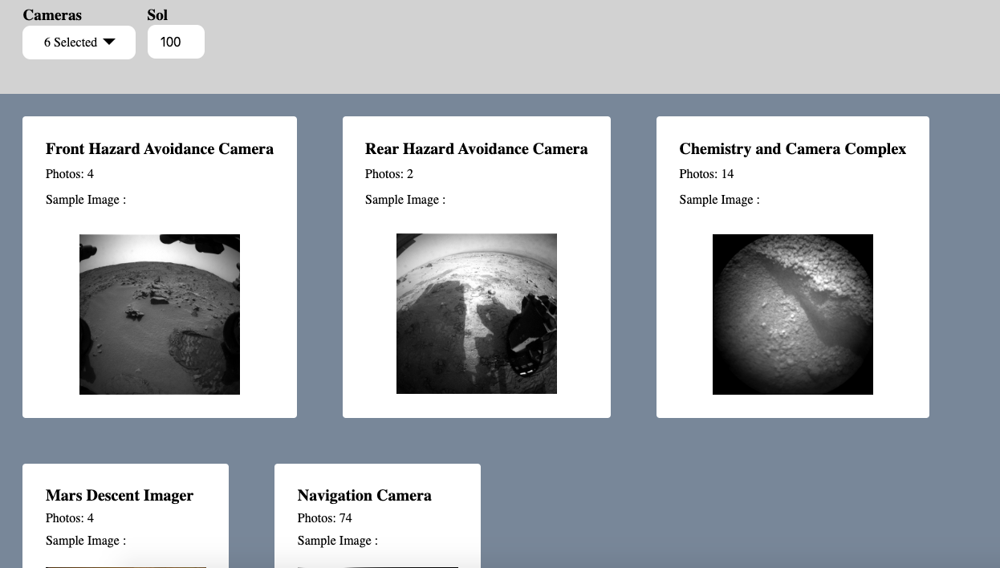

# LeanTaas Front End Coding Challenge By Chris Krajewski

## Contribution

I've collected a list of [Improvements](#improvements) that need to be done.
If you'd like to help by contributing to the project, you're more than welcome to! 

## Install and run

First clone the repository:

```
git clone https://github.com/ckrajewski/LeanTaas
```

Open a terminal and cd into the `LeanTaas` folder. Then:

1. `npm install` (installs the node modules and the TypeScript definition files)
2. `npm start` 

Your default browser should automatically open and redirect you to `http://localhost:8080` where the website will be running!

It may open the tab before everything is loaded, but that's OK. After waiting for a bit, it should load :)


## Running Tests

Open a terminal and cd into the `Zendesk` folder. Then:

1. `npm test` 

Your terminal will scan through and run the tests in the test directory using Jest

## Looking at the code

To take a close look at the front end code (React) feel free to use any text editor i.e. Sublime/Atom. Here's not the time to argue which is better :) 

## The Custom Select Component

That's what this is all about right?

This component makes your life easy!

Simply pass in a list of SelectItem Components (item and value).

An onChange event handler bubbles up the list selected values for you!

Capture this event to then decide where and how to handle the user's selected values



## Tools Used

- React and Redux.
- Webpack to bundle JS, and webpack-dev-server to run client side code on port 8080
- Node, Express, and Nodemon for backend (server) code. Server runs on port 3000
- ESLint used for formatting
- Jest and Enzyme for testing

## Feedback
In case you have any comments, questions, bugs, enhancements feel free to open an issue in this repository.

## Improvements
- [ ] Figure out how to close drop down when clicking anywhere outside on the page
- [ ] Add better error handling
- [ ] Prevent multiple servers calls from being made onChange. Can bog down NASA servers and cause an HTTP 429 error code

## Sample Screenshots of Project

### No Images Found Screen


### Loading Screen



### Images Returned Screen

